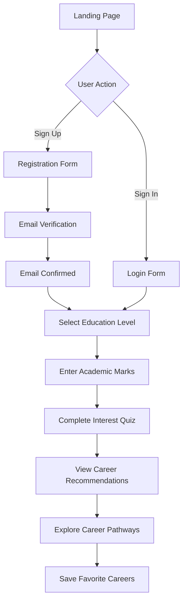
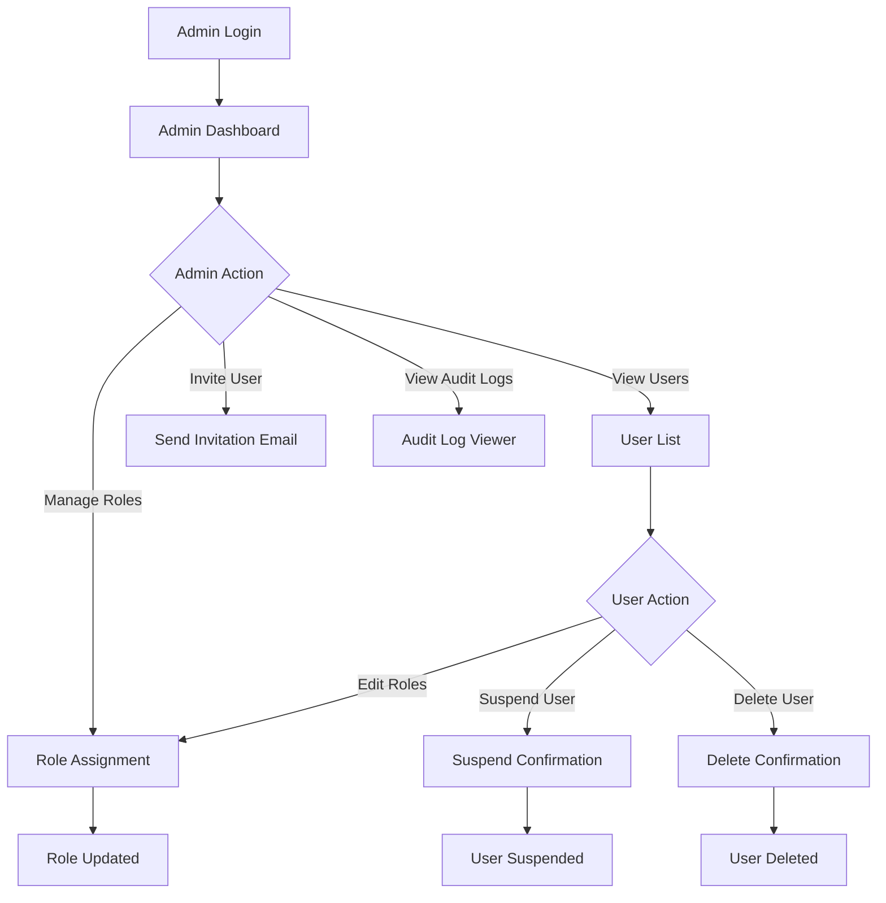
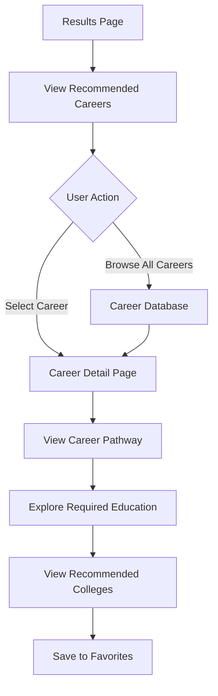

# Product Requirements Document (PRD)
## Zertainity - AI-Powered Career Guidance Platform

**Version:** 2.0  
**Last Updated:** February 7, 2026  
**Document Owner:** Product Team  
**Status:** Enhanced with Advanced Features

---

## Executive Summary

Zertainity is an AI-powered career guidance platform designed to help students discover their ideal career paths through comprehensive assessments, personalized recommendations, and detailed roadmaps. The platform bridges the gap between academic performance and career planning by providing data-driven insights and actionable pathways from school to dream careers.

### Vision
To become the leading career guidance platform that empowers every student to make informed decisions about their future through personalized, AI-driven insights.

### Mission
Democratize access to quality career counseling by providing students with comprehensive assessments, personalized recommendations, and clear roadmaps to achieve their career goals.

---

## Product Overview

### Target Audience

#### Primary Users
- **Students (10th-12th Grade)**: High school students exploring career options based on their academic performance and interests
- **Undergraduate Students**: College students seeking career direction and pathway planning
- **Recent Graduates**: Young professionals looking to validate or pivot their career choices

#### Secondary Users
- **Parents/Guardians**: Supporting students in making informed career decisions
- **Educational Institutions**: Schools and colleges seeking to provide career guidance services
- **Career Counselors**: Professionals using the platform as a tool for student counseling

#### Administrative Users
- **Platform Administrators**: Managing users, content, and system operations
- **Content Editors**: Maintaining career information, pathways, and assessment content

### Market Opportunity

- **Market Size**: Growing EdTech market with increasing demand for personalized career guidance
- **Pain Points Addressed**:
  - Lack of personalized career guidance in educational institutions
  - Information overload and confusion about career options
  - Disconnect between academic performance and career planning
  - Limited access to quality career counseling services
  - Unclear pathways from education to employment

### Competitive Advantages

1. **AI-Powered Personalization**: Tailored recommendations based on academic performance and interests
2. **Comprehensive Assessment**: Multi-dimensional evaluation including marks, interests, and aptitude
3. **Detailed Roadmaps**: Step-by-step pathways from current education level to career goals
4. **Premium User Experience**: Apple-inspired minimalist design with intuitive navigation
5. **Role-Based Access Control**: Enterprise-grade admin panel for institutional adoption

---

## User Personas

### Persona 1: Priya - The Ambitious 12th Grader

**Demographics:**
- Age: 17
- Education: 12th Grade (Science Stream)
- Location: Urban India
- Tech Savvy: High

**Goals:**
- Discover career options aligned with her academic strengths
- Understand the pathway to become a software engineer
- Make informed decisions about college selection

**Pain Points:**
- Overwhelmed by too many career options
- Unsure if her marks are sufficient for desired careers
- Lacks clarity on the steps needed after 12th grade

**How Zertainity Helps:**
- Personalized career recommendations based on her marks and interests
- Clear roadmap showing required colleges, courses, and skills
- Detailed career information with salary expectations and growth prospects

### Persona 2: Rahul - The Confused Graduate

**Demographics:**
- Age: 22
- Education: B.Com Graduate
- Location: Tier-2 City
- Tech Savvy: Medium

**Goals:**
- Explore career options beyond traditional commerce roles
- Understand if he should pursue higher education or start working
- Discover careers that match his interests in technology and finance

**Pain Points:**
- Limited career guidance during college
- Unsure about the relevance of his degree to modern careers
- Lacks network and mentorship for career planning

**How Zertainity Helps:**
- Interest-based assessment revealing suitable career paths
- Pathways showing both immediate job opportunities and upskilling options
- Comprehensive career database including emerging fields

### Persona 3: Ms. Sharma - School Career Counselor

**Demographics:**
- Age: 35
- Role: Career Counselor at Private School
- Location: Metropolitan City
- Tech Savvy: Medium

**Goals:**
- Provide data-driven career guidance to students
- Track student assessments and recommendations
- Manage career guidance program efficiently

**Pain Points:**
- Limited time to counsel each student individually
- Difficulty in keeping career information updated
- Lack of tools to track student progress

**How Zertainity Helps:**
- Scalable platform to serve multiple students simultaneously
- Admin panel to manage student accounts and track assessments
- Always-updated career information and pathways

---

## Core Features & Requirements

### 1. User Authentication & Authorization

#### 1.1 User Registration
**Priority:** P0 (Must Have)

**Requirements:**
- Users can sign up using email and password
- Users can sign up using Google OAuth
- Email verification required before account activation
- Password must meet security requirements (min 8 characters, mix of letters/numbers)
- User profile created automatically upon registration

**Acceptance Criteria:**
- [ ] Email signup form validates input fields
- [ ] Google OAuth redirects correctly and creates user account
- [ ] Verification email sent within 1 minute of registration
- [ ] User cannot access protected routes until email verified
- [ ] User profile record created in database upon successful registration

#### 1.2 User Login
**Priority:** P0 (Must Have)

**Requirements:**
- Users can log in with email and password
- Users can log in with Google OAuth
- Session persists across browser sessions
- Automatic redirect to home page if already authenticated
- "Remember me" functionality for extended sessions

**Acceptance Criteria:**
- [ ] Login form validates credentials
- [ ] Invalid credentials show appropriate error message
- [ ] Successful login redirects to intended page or home
- [ ] Session token stored securely
- [ ] Authenticated users redirected from /auth page

#### 1.3 Role-Based Access Control (RBAC)
**Priority:** P0 (Must Have)

**Requirements:**
- Five role levels: Owner, Admin, Manager, Editor, User
- Granular permission system with 12 distinct permissions
- Role hierarchy enforced (Owner > Admin > Manager > Editor > User)
- Users can have multiple roles simultaneously
- Permissions inherited from all assigned roles

**Roles & Permissions:**

| Role | Permissions |
|------|-------------|
| **Owner** | All permissions (full system control) |
| **Admin** | view_all, view_users, manage_users, manage_roles, view_audit_logs, export_data, all edit_* permissions |
| **Manager** | view_all, view_users, manage_users, view_audit_logs |
| **Editor** | view_all, edit_careers, edit_colleges, edit_schools, edit_pathways, edit_quiz |
| **User** | view_all (basic access) |

**Acceptance Criteria:**
- [ ] Role assignment enforced at database level via RLS
- [ ] Permission checks performed before sensitive operations
- [ ] Users can only perform actions they have permissions for
- [ ] Role changes reflected immediately in user session
- [ ] Audit log captures all role/permission changes

---

### 2. Career Assessment Flow

#### 2.1 Education Level Selection
**Priority:** P0 (Must Have)

**Requirements:**
- Users select their current education level: 10th, 12th, or Graduate
- Selection determines subsequent assessment questions
- Visual cards with clear descriptions for each level
- Progress indicator showing step 1 of 4

**Acceptance Criteria:**
- [ ] Three education level options displayed clearly
- [ ] Selection stored in user session/profile
- [ ] Navigation to marks entry page upon selection
- [ ] Back button allows changing selection
- [ ] Mobile-responsive card layout

#### 2.2 Academic Marks Entry
**Priority:** P0 (Must Have)

**Requirements:**
- Dynamic form based on selected education level
- Subject-wise marks entry with validation
- Percentage/CGPA calculation
- Support for different grading systems
- Optional fields for additional subjects

**10th Grade Fields:**
- English, Mathematics, Science, Social Studies, Optional Subject
- Total marks and percentage calculation

**12th Grade Fields:**
- Stream-specific subjects (Science/Commerce/Arts)
- Core subjects + electives
- Board exam marks or predicted scores

**Graduate Fields:**
- Degree type and specialization
- CGPA or percentage
- Major subjects and grades

**Acceptance Criteria:**
- [ ] Form adapts to selected education level
- [ ] Marks validation (0-100 range or valid CGPA)
- [ ] Automatic percentage/CGPA calculation
- [ ] Error messages for invalid inputs
- [ ] Data saved before proceeding to next step

#### 2.3 Interest Assessment Quiz
**Priority:** P0 (Must Have)

**Requirements:**
- 20-30 questions assessing interests across multiple dimensions
- Question types: multiple choice, rating scales, scenario-based
- Categories: Technical, Creative, Social, Analytical, Practical, Leadership
- Progress tracking with visual indicator
- Ability to review and change answers
- Time tracking (optional)

**Question Dimensions:**
- **Technical**: Interest in technology, engineering, programming
- **Creative**: Art, design, writing, innovation
- **Social**: People interaction, helping others, communication
- **Analytical**: Problem-solving, research, data analysis
- **Practical**: Hands-on work, building, implementation
- **Leadership**: Management, decision-making, team coordination

**Acceptance Criteria:**
- [ ] Questions displayed one at a time or in sections
- [ ] Progress bar shows completion percentage
- [ ] All questions must be answered to proceed
- [ ] Answers saved incrementally (auto-save)
- [ ] Review screen shows all answers before submission
- [ ] Quiz completion time recorded

#### 2.4 AI-Powered Career Recommendations
**Priority:** P0 (Must Have)

**Requirements:**
- Generate 5-10 personalized career recommendations
- Ranking based on match score (academic performance + interests)
- Each recommendation includes:
  - Career title and brief description
  - Match percentage
  - Required education level
  - Average salary range
  - Key skills required
  - Growth prospects
  - Related careers

**Recommendation Algorithm:**
1. Analyze academic performance (40% weight)
2. Analyze interest assessment results (40% weight)
3. Consider education level and feasibility (20% weight)
4. Filter careers requiring higher qualifications than current level
5. Rank by composite match score

**Acceptance Criteria:**
- [ ] Minimum 5 career recommendations generated
- [ ] Match scores calculated accurately
- [ ] Recommendations sorted by match percentage
- [ ] Each career card displays all required information
- [ ] Users can save favorite careers
- [ ] Users can explore detailed career pathways

---

### 3. Career Exploration

#### 3.1 Career Pathways
**Priority:** P0 (Must Have)

**Requirements:**
- Detailed roadmap from current education level to career goal
- Step-by-step timeline with milestones
- Required education, certifications, and skills
- Recommended colleges/institutions
- Estimated time and cost
- Alternative pathways for same career

**Pathway Components:**
- **Education Path**: Required degrees, courses, specializations
- **Skill Development**: Technical and soft skills to acquire
- **Certifications**: Industry-recognized certifications
- **Experience**: Internships, projects, entry-level positions
- **Networking**: Communities, events, mentorship opportunities
- **Timeline**: Estimated duration for each phase

**Acceptance Criteria:**
- [ ] Pathway displayed as visual timeline or flowchart
- [ ] Each milestone shows requirements and resources
- [ ] College recommendations with cutoffs and locations
- [ ] Skill recommendations with learning resources
- [ ] Total estimated time and cost calculated
- [ ] Users can bookmark pathways

#### 3.2 Career Database
**Priority:** P1 (Should Have)

**Requirements:**
- Comprehensive database of 100+ careers
- Search and filter functionality
- Categories: Technology, Healthcare, Business, Creative, etc.
- Detailed career profiles with:
  - Job description and responsibilities
  - Required qualifications
  - Salary ranges (entry, mid, senior levels)
  - Work environment and lifestyle
  - Career growth trajectory
  - Industry trends and outlook
  - Related careers and transitions

**Acceptance Criteria:**
- [ ] Search returns relevant results
- [ ] Filters work correctly (category, education level, salary)
- [ ] Career profiles display all required information
- [ ] Users can compare multiple careers
- [ ] Career data updated regularly

#### 3.3 College & School Database
**Priority:** P1 (Should Have)

**Requirements:**
- Database of colleges and schools
- Location-based search with map integration
- Filters: courses, cutoffs, location, fees
- College profiles include:
  - Name and location
  - Courses offered
  - Admission cutoffs
  - Fees structure
  - Placement statistics
  - Campus facilities
  - Contact information

**Acceptance Criteria:**
- [ ] Search and filter functionality works
- [ ] Map shows college locations accurately
- [ ] College profiles display complete information
- [ ] Users can save favorite colleges
- [ ] Data updated annually

---

### 4. Admin Panel

#### 4.1 User Management
**Priority:** P0 (Must Have)

**Requirements:**
- View all registered users with roles
- Search and filter users
- Invite new users via email
- Assign/remove roles
- Suspend/unsuspend user accounts
- Delete user accounts (with confirmation)
- View user activity logs

**User List Columns:**
- Email, Name, Roles, Created Date, Last Sign In, Status (Active/Suspended)

**Actions:**
- Invite User, Edit Roles, Suspend, Unsuspend, Delete, View Activity

**Acceptance Criteria:**
- [ ] User list displays all users with pagination
- [ ] Search filters users by email/name
- [ ] Role assignment updates immediately
- [ ] Suspension prevents user login
- [ ] Delete action requires confirmation
- [ ] Activity logs show user actions

#### 4.2 Role & Permission Management
**Priority:** P0 (Must Have)

**Requirements:**
- View all roles and their permissions
- Assign permissions to roles (Owner only)
- View users by role
- Audit trail for role/permission changes

**Acceptance Criteria:**
- [ ] Permission matrix displayed clearly
- [ ] Only owners can modify permissions
- [ ] Changes logged in audit trail
- [ ] Role changes reflected immediately

#### 4.3 Content Management
**Priority:** P1 (Should Have)

**Requirements:**
- Editors can add/edit/delete careers
- Editors can add/edit/delete colleges
- Editors can add/edit/delete schools
- Editors can modify quiz questions
- Editors can update career pathways
- Version control for content changes

**Acceptance Criteria:**
- [ ] CRUD operations work for all content types
- [ ] Changes require appropriate permissions
- [ ] Content changes logged in audit trail
- [ ] Preview before publishing

#### 4.4 Analytics & Reporting
**Priority:** P2 (Nice to Have)

**Requirements:**
- User registration trends
- Assessment completion rates
- Popular career recommendations
- User engagement metrics
- Export data as CSV/Excel

**Acceptance Criteria:**
- [ ] Dashboard displays key metrics
- [ ] Charts and graphs visualize trends
- [ ] Data export functionality works
- [ ] Reports can be filtered by date range

#### 4.5 Audit Logging
**Priority:** P0 (Must Have)

**Requirements:**
- Log all sensitive operations
- Capture: user, action, timestamp, IP, user agent
- Before/after snapshots for data changes
- Searchable and filterable logs
- Retention policy (minimum 1 year)

**Logged Actions:**
- User role changes
- User suspension/deletion
- Permission modifications
- Content changes
- Failed login attempts

**Acceptance Criteria:**
- [ ] All sensitive actions logged automatically
- [ ] Logs include complete context
- [ ] Search and filter functionality works
- [ ] Logs cannot be modified or deleted
- [ ] Managers and above can view audit logs

---

### 5. User Profile

#### 5.1 Profile Management
**Priority:** P1 (Should Have)

**Requirements:**
- View and edit personal information
- Upload profile picture
- Update contact details
- Change password
- View assessment history
- View saved careers and pathways
- Delete account (with confirmation)

**Profile Fields:**
- Name, Email, Phone, Date of Birth, Location, Bio, Avatar

**Acceptance Criteria:**
- [ ] Users can update all profile fields
- [ ] Avatar upload supports common image formats
- [ ] Password change requires current password
- [ ] Assessment history shows all completed assessments
- [ ] Saved items displayed in organized lists
- [ ] Account deletion requires confirmation and password

---

### 6. AI-Powered Career Chatbot
**Priority:** P1 (Should Have)

#### 6.1 Intelligent Career Assistant
**Requirements:**
- 24/7 AI chatbot for career guidance queries
- Natural language processing for understanding student questions
- Context-aware responses based on user's assessment results
- Multi-turn conversations with conversation history
- Integration with career database for accurate information
- Multilingual support (English, Hindi, regional languages)

**Chatbot Capabilities:**
- Answer career-related questions
- Explain career pathways and requirements
- Suggest colleges based on preferences
- Provide study tips and exam preparation guidance
- Clarify doubts about assessment results
- Recommend resources (courses, books, websites)

**Acceptance Criteria:**
- [ ] Chatbot responds within 2 seconds
- [ ] Maintains conversation context for 30 minutes
- [ ] Accuracy rate > 85% for career-related queries
- [ ] Escalation to human support for complex queries
- [ ] Chat history saved and accessible to users
- [ ] Sentiment analysis to detect frustrated users

---

### 7. Skill Assessment & Gap Analysis
**Priority:** P1 (Should Have)

#### 7.1 Technical Skill Tests
**Requirements:**
- Domain-specific skill assessments (coding, design, writing, etc.)
- Adaptive testing that adjusts difficulty based on performance
- Timed tests with instant results
- Skill proficiency levels: Beginner, Intermediate, Advanced, Expert
- Detailed performance reports with strengths and weaknesses
- Skill badges and certificates upon completion

**Skill Categories:**
- **Programming**: Python, Java, JavaScript, C++, Data Structures
- **Design**: UI/UX, Graphic Design, Video Editing
- **Business**: Excel, Financial Analysis, Marketing
- **Communication**: Writing, Public Speaking, Presentation
- **Languages**: English proficiency, regional languages

**Acceptance Criteria:**
- [ ] Tests adapt to user performance in real-time
- [ ] Results show percentile ranking
- [ ] Detailed feedback on each question
- [ ] Skill gap analysis with learning recommendations
- [ ] Certificates shareable on LinkedIn/resume

#### 7.2 Soft Skills Evaluation
**Requirements:**
- Personality assessments (Big Five, MBTI-style)
- Emotional intelligence evaluation
- Leadership potential assessment
- Teamwork and collaboration skills
- Problem-solving and critical thinking tests
- Video-based situational judgment tests

**Acceptance Criteria:**
- [ ] Comprehensive personality profile generated
- [ ] Soft skills mapped to suitable careers
- [ ] Improvement suggestions provided
- [ ] Progress tracking over time

---

### 8. Mentorship & Networking
**Priority:** P2 (Nice to Have)

#### 8.1 Mentor Matching System
**Requirements:**
- Database of verified industry professionals
- AI-powered mentor-mentee matching based on:
  - Career interests
  - Industry experience
  - Educational background
  - Personality compatibility
- Mentor profiles with expertise, availability, and ratings
- In-app messaging and video call scheduling
- Mentorship session tracking and feedback

**Mentor Types:**
- Industry professionals (5+ years experience)
- Recent graduates (1-3 years experience)
- Career counselors and coaches
- Entrepreneurs and startup founders

**Acceptance Criteria:**
- [ ] Mentor verification process in place
- [ ] Matching algorithm achieves 80%+ satisfaction
- [ ] Session scheduling integrated with calendar
- [ ] Rating and review system for mentors
- [ ] Background checks for mentor safety

#### 8.2 Peer Community & Forums
**Requirements:**
- Discussion forums organized by career fields
- Study groups and peer learning circles
- Q&A platform (Stack Overflow style)
- Success stories and experience sharing
- Event announcements (webinars, workshops, job fairs)
- Moderation tools to prevent spam and abuse

**Acceptance Criteria:**
- [ ] Forums categorized by topics
- [ ] Upvoting/downvoting for quality content
- [ ] Reputation system for active contributors
- [ ] Moderation queue for reported content
- [ ] Mobile notifications for replies

---

### 9. Learning Resources & Course Recommendations
**Priority:** P1 (Should Have)

#### 9.1 Personalized Learning Paths
**Requirements:**
- Curated learning resources for each career pathway
- Integration with online learning platforms (Coursera, Udemy, Khan Academy)
- Free and paid course recommendations
- Skill-based course suggestions
- Progress tracking for enrolled courses
- Certification tracking

**Resource Types:**
- Online courses (MOOCs)
- YouTube tutorials and playlists
- Books and e-books
- Podcasts and webinars
- Practice projects and assignments
- Industry blogs and articles

**Acceptance Criteria:**
- [ ] Recommendations based on skill gaps
- [ ] Courses filtered by price, duration, difficulty
- [ ] User ratings and reviews for courses
- [ ] Bookmark and save courses for later
- [ ] Completion certificates uploaded to profile

#### 9.2 Scholarship & Financial Aid Finder
**Requirements:**
- Database of scholarships, grants, and financial aid
- Eligibility checker based on user profile
- Application deadline reminders
- Document checklist for applications
- Success rate statistics for each scholarship
- Essay tips and sample applications

**Acceptance Criteria:**
- [ ] Scholarships filtered by eligibility criteria
- [ ] Automated email reminders for deadlines
- [ ] Application tracking dashboard
- [ ] Success stories from scholarship recipients

---

### 10. Gamification & Engagement
**Priority:** P2 (Nice to Have)

#### 10.1 Achievement System
**Requirements:**
- Points and badges for platform activities
- Leaderboards (weekly, monthly, all-time)
- Achievement milestones:
  - Complete assessment
  - Take skill tests
  - Connect with mentors
  - Complete learning modules
  - Help peers in forums
  - Refer friends

**Badge Categories:**
- Explorer: Complete career assessments
- Scholar: Complete learning courses
- Mentor: Help other students
- Achiever: Reach career milestones
- Influencer: High forum engagement

**Acceptance Criteria:**
- [ ] Points awarded for all activities
- [ ] Badges displayed on user profile
- [ ] Leaderboards updated in real-time
- [ ] Rewards for top performers (premium features, certificates)

#### 10.2 Challenges & Competitions
**Requirements:**
- Weekly/monthly career challenges
- Skill-based competitions (coding, design, writing)
- Prizes and recognition for winners
- Team-based challenges
- Hackathons and case study competitions

**Acceptance Criteria:**
- [ ] New challenges posted regularly
- [ ] Automated judging for objective tests
- [ ] Winner announcements and certificates
- [ ] Challenge history and performance stats

---

### 11. Career Opportunities & Job Portal
**Priority:** P1 (Should Have)

#### 11.1 Internship & Job Listings
**Requirements:**
- Curated internship and entry-level job listings
- Integration with job boards (LinkedIn, Indeed, Naukri)
- AI-powered job matching based on user profile
- Application tracking system
- Resume builder and review
- Interview preparation resources

**Job Listing Features:**
- Company information and culture
- Salary ranges and benefits
- Required skills and qualifications
- Application deadline and process
- Employee reviews and ratings

**Acceptance Criteria:**
- [ ] Jobs filtered by location, salary, experience
- [ ] One-click apply with saved resume
- [ ] Application status tracking
- [ ] Job alerts via email/push notifications
- [ ] Interview tips for specific companies

#### 11.2 Resume & Portfolio Builder
**Requirements:**
- Professional resume templates (ATS-friendly)
- AI-powered resume optimization
- Portfolio builder for creative fields
- LinkedIn profile optimization
- Cover letter generator
- Resume review by AI and mentors

**Acceptance Criteria:**
- [ ] Multiple resume templates available
- [ ] Export as PDF, DOCX
- [ ] ATS compatibility checker
- [ ] Keyword optimization suggestions
- [ ] Portfolio hosting with custom URL

---

### 12. Live Sessions & Webinars
**Priority:** P2 (Nice to Have)

#### 12.1 Expert Webinars
**Requirements:**
- Live webinars with industry experts
- Career guidance sessions by counselors
- College admission workshops
- Skill development workshops
- Q&A sessions with professionals
- Recorded sessions available on-demand

**Webinar Topics:**
- Career exploration and planning
- Exam preparation strategies
- College application process
- Interview skills and resume building
- Industry trends and future careers
- Entrepreneurship and startups

**Acceptance Criteria:**
- [ ] Calendar of upcoming webinars
- [ ] Registration and reminder system
- [ ] Live chat during webinars
- [ ] Recording available within 24 hours
- [ ] Certificates of participation

#### 12.2 Virtual Career Fairs
**Requirements:**
- Online career fairs with multiple companies
- Virtual booths with company representatives
- Live chat with recruiters
- Resume submission and screening
- On-the-spot interview scheduling
- Networking opportunities

**Acceptance Criteria:**
- [ ] Virtual fair platform with video/chat
- [ ] Company profiles and job openings
- [ ] Attendee registration and tracking
- [ ] Post-event follow-up emails
- [ ] Analytics on attendee engagement

---

### 13. Parent & Guardian Portal
**Priority:** P2 (Nice to Have)

#### 13.1 Parent Dashboard
**Requirements:**
- View student's assessment results (with permission)
- Track student's progress and activities
- Receive updates on student's career exploration
- Access to parental guidance resources
- Communication with counselors
- Financial planning tools for education

**Dashboard Features:**
- Student's career recommendations
- Completed assessments and skill tests
- Saved colleges and courses
- Application deadlines and reminders
- Scholarship opportunities
- Estimated education costs

**Acceptance Criteria:**
- [ ] Parent account linked to student account
- [ ] Privacy controls for student data sharing
- [ ] Weekly/monthly progress reports
- [ ] Parental guidance articles and videos
- [ ] Direct messaging with counselors

---

### 14. Mobile App (Native)
**Priority:** P1 (Should Have)

#### 14.1 iOS & Android Apps
**Requirements:**
- Native mobile apps for iOS and Android
- Feature parity with web application
- Offline mode for assessments and content
- Push notifications for important updates
- Biometric authentication (Face ID, fingerprint)
- Camera integration for document uploads

**Mobile-Specific Features:**
- Quick assessment mode
- Daily career tips notifications
- Voice-based career search
- AR campus tours (future)
- Location-based college recommendations

**Acceptance Criteria:**
- [ ] Apps available on App Store and Play Store
- [ ] Offline functionality for core features
- [ ] Push notifications for deadlines, messages
- [ ] App size < 50MB
- [ ] 4.5+ star rating on app stores

---

### 15. Analytics & Insights Dashboard
**Priority:** P1 (Should Have)

#### 15.1 Personal Career Analytics
**Requirements:**
- Comprehensive dashboard showing user's career journey
- Progress tracking towards career goals
- Skill development timeline
- Comparison with peers (anonymized)
- Predictive analytics for career success
- Personalized recommendations based on behavior

**Analytics Metrics:**
- Assessment completion rate
- Skill proficiency scores over time
- Learning hours and courses completed
- Mentor sessions attended
- Job applications submitted
- Career readiness score (0-100)

**Acceptance Criteria:**
- [ ] Visual charts and graphs
- [ ] Exportable reports (PDF)
- [ ] Weekly insights email
- [ ] Goal setting and tracking
- [ ] Milestone celebrations

#### 15.2 Institutional Analytics (For Schools)
**Requirements:**
- School-wide career guidance analytics
- Student engagement metrics
- Popular career choices by cohort
- Assessment completion rates
- Success tracking (college admissions, placements)
- Benchmarking against other institutions

**Acceptance Criteria:**
- [ ] Role-based access for school admins
- [ ] Customizable date ranges
- [ ] Export data for reporting
- [ ] Student privacy maintained
- [ ] Actionable insights and recommendations

---

### 16. Accessibility & Inclusion Features
**Priority:** P1 (Should Have)

#### 16.1 Multilingual Support
**Requirements:**
- Platform available in 10+ Indian languages
- Hindi, Tamil, Telugu, Bengali, Marathi, Gujarati, Kannada, Malayalam, Punjabi, Urdu
- Auto-translation for user-generated content
- Language preference saved in profile
- Regional content and career information

**Acceptance Criteria:**
- [ ] Complete translation of UI and content
- [ ] Language switcher in navigation
- [ ] RTL support for Urdu
- [ ] Regional career data available
- [ ] Translation quality > 90% accuracy

#### 16.2 Accessibility Features
**Requirements:**
- Screen reader optimization
- High contrast mode for visually impaired
- Text-to-speech for content
- Keyboard-only navigation
- Adjustable font sizes
- Closed captions for videos
- Sign language interpretation for webinars

**Acceptance Criteria:**
- [ ] WCAG 2.1 AAA compliance
- [ ] Tested with screen readers (JAWS, NVDA)
- [ ] Accessibility audit passed
- [ ] User testing with disabled users
- [ ] Accessibility statement published

---

### 17. Integration & API Ecosystem
**Priority:** P2 (Nice to Have)

#### 17.1 Third-Party Integrations
**Requirements:**
- Google Calendar integration for events
- LinkedIn profile import and sync
- Zoom/Google Meet for video sessions
- Payment gateway for premium features
- Email marketing tools (Mailchimp)
- CRM integration for institutional clients

**Acceptance Criteria:**
- [ ] OAuth authentication for integrations
- [ ] Data sync in real-time
- [ ] Error handling and fallbacks
- [ ] Integration settings in user profile

#### 17.2 Public API for Developers
**Requirements:**
- RESTful API for career data
- Webhooks for real-time updates
- API documentation (Swagger/OpenAPI)
- Rate limiting and authentication
- Developer portal with API keys
- SDKs for popular languages

**Use Cases:**
- Schools integrating Zertainity into their LMS
- Third-party apps using career data
- Research institutions accessing anonymized data
- Career counselors building custom tools

**Acceptance Criteria:**
- [ ] API documentation comprehensive
- [ ] Rate limits clearly defined
- [ ] API versioning implemented
- [ ] Developer sandbox environment
- [ ] Usage analytics for API consumers

---

### 18. Premium Features & Monetization
**Priority:** P1 (Should Have)

#### 18.1 Freemium Model
**Requirements:**
- Free tier with core features
- Premium subscription with advanced features
- Institutional licenses for schools/colleges
- Pay-per-use for specific services

**Free Tier Includes:**
- Basic career assessment
- 5 career recommendations
- Career database access
- Basic skill tests
- Community forum access

**Premium Tier Includes ($9.99/month or $99/year):**
- Unlimited assessments and retakes
- Advanced AI recommendations
- Detailed skill gap analysis
- Mentor matching (2 sessions/month)
- Priority support
- Ad-free experience
- Resume review by experts
- Exclusive webinars and workshops
- Downloadable reports and certificates
- Early access to new features

**Institutional Licenses:**
- Custom pricing based on student count
- Dedicated account manager
- White-label options
- Custom branding
- Advanced analytics dashboard
- API access
- Training for counselors

**Acceptance Criteria:**
- [ ] Payment gateway integrated (Stripe/Razorpay)
- [ ] Subscription management system
- [ ] Automatic billing and renewals
- [ ] Refund policy implemented
- [ ] Invoice generation

---

### 19. Content Creation & Management
**Priority:** P1 (Should Have)

#### 19.1 Blog & Career Articles
**Requirements:**
- Career guidance blog with SEO optimization
- Articles on trending careers
- Success stories and case studies
- Expert interviews and insights
- Study tips and exam preparation
- Industry news and updates

**Content Types:**
- How-to guides
- Career comparison articles
- College admission guides
- Scholarship opportunities
- Industry trends and forecasts
- Student success stories

**Acceptance Criteria:**
- [ ] CMS for content editors
- [ ] SEO optimization tools
- [ ] Social media sharing
- [ ] Comments and discussions
- [ ] Content calendar and scheduling

#### 19.2 Video Content Library
**Requirements:**
- Career exploration videos
- Day-in-the-life of professionals
- College campus tours
- Interview preparation videos
- Skill tutorial videos
- Motivational content

**Acceptance Criteria:**
- [ ] Video hosting (YouTube/Vimeo integration)
- [ ] Categorized video library
- [ ] Playlists for learning paths
- [ ] Closed captions available
- [ ] Video progress tracking

---

### 20. Social Features & Sharing
**Priority:** P2 (Nice to Have)

#### 20.1 Social Sharing
**Requirements:**
- Share assessment results on social media
- Share career goals and achievements
- Referral program with rewards
- Social proof (testimonials, success stories)
- Viral loops for user acquisition

**Shareable Content:**
- Career match results
- Skill badges and certificates
- Learning milestones
- Mentor testimonials
- Success stories

**Acceptance Criteria:**
- [ ] One-click sharing to Facebook, Twitter, LinkedIn, WhatsApp
- [ ] Custom share images with branding
- [ ] Referral tracking and rewards
- [ ] Privacy controls for sharing
- [ ] Social media preview optimization

#### 20.2 Student Success Stories
**Requirements:**
- Platform for students to share their journey
- Before/after career transformation stories
- Video testimonials
- Featured success stories on homepage
- Inspiration for new users

**Acceptance Criteria:**
- [ ] Story submission form
- [ ] Moderation and approval workflow
- [ ] Featured stories section
- [ ] Search and filter by career/college
- [ ] Social sharing of stories

---

## Technical Requirements

### 6. Architecture & Technology Stack

#### 6.1 Frontend
**Technology:** React 18 + TypeScript + Vite

**Requirements:**
- Component-based architecture
- Type-safe development with TypeScript
- Fast build and hot module replacement with Vite
- Responsive design (mobile-first)
- Progressive Web App (PWA) capabilities

**Key Libraries:**
- **UI Components**: shadcn/ui (Radix UI primitives)
- **Styling**: Tailwind CSS with custom design tokens
- **State Management**: TanStack React Query
- **Routing**: React Router DOM v6
- **Forms**: React Hook Form + Zod validation
- **Icons**: Lucide React

**Acceptance Criteria:**
- [ ] All pages load within 2 seconds on 3G connection
- [ ] Mobile-responsive design works on all screen sizes
- [ ] TypeScript strict mode enabled with no errors
- [ ] Code splitting implemented for optimal bundle size
- [ ] Accessibility standards (WCAG 2.1 AA) met

#### 6.2 Backend
**Technology:** Supabase (PostgreSQL + Edge Functions)

**Requirements:**
- PostgreSQL database with Row-Level Security (RLS)
- Serverless Edge Functions for sensitive operations
- Real-time subscriptions for live updates
- Secure API with JWT authentication

**Edge Functions:**
1. `setup-admin`: First-time admin setup
2. `invite-user`: Send user invitations
3. `update-user-role`: Manage user roles
4. `suspend-user`: Suspend user accounts
5. `unsuspend-user`: Restore suspended accounts
6. `delete-user`: Permanently delete users
7. `export-users`: Export user data
8. `send-notification`: Send notifications

**Acceptance Criteria:**
- [ ] All database tables have RLS policies enabled
- [ ] Edge Functions handle authentication and authorization
- [ ] API responses within 500ms for 95th percentile
- [ ] Database queries optimized with proper indexes
- [ ] Backup and recovery procedures in place

#### 6.3 Authentication
**Technology:** Supabase Auth

**Requirements:**
- Email/password authentication
- Google OAuth integration
- Email verification workflow
- Password reset functionality
- Session management with automatic refresh
- Multi-device session support

**Acceptance Criteria:**
- [ ] Email verification required before account activation
- [ ] OAuth flow completes without errors
- [ ] Password reset emails delivered within 1 minute
- [ ] Sessions persist across browser restarts
- [ ] Concurrent sessions supported

#### 6.4 Database Schema

**Core Tables:**
- `user_roles`: User role assignments
- `role_permissions`: Role-permission mappings
- `user_profiles`: Extended user information
- `suspended_users`: Suspended account records
- `audit_log`: System audit trail
- `user_activity_log`: User activity tracking
- `colleges`: College database
- `schools`: School database
- `careers`: Career information (future)
- `pathways`: Career pathway data (future)
- `quiz_questions`: Assessment questions (future)
- `user_assessments`: Assessment results (future)

**Database Functions:**
- `has_role(user_id, role)`: Check if user has specific role
- `has_permission(user_id, permission)`: Check if user has permission
- `is_owner(user_id)`: Check if user is owner
- `get_all_users_with_roles()`: Retrieve all users with roles (admin only)

**Acceptance Criteria:**
- [ ] All tables have proper indexes
- [ ] Foreign key constraints enforced
- [ ] RLS policies tested and verified
- [ ] Database functions perform efficiently
- [ ] Migration scripts version controlled

---

### 7. Design & User Experience

#### 7.1 Design System
**Philosophy:** Apple-inspired premium aesthetic

**Principles:**
- Minimalist, clean interfaces
- Neutral color palette (no colorful gradients)
- Generous white space
- Clean typography with SF-style fonts
- Subtle shadows and borders
- No decorative images
- Content-first approach

**Color Palette (HSL):**
```css
--background: 0 0% 100%
--foreground: 0 0% 3.9%
--primary: 0 0% 9%
--secondary: 0 0% 96.1%
--muted: 0 0% 96.1%
--accent: 0 0% 96.1%
--border: 0 0% 89.8%
```

**Typography:**
- Font Family: System fonts (SF Pro style)
- Font Weights: 300 (light), 400 (regular), 500 (medium), 600 (semibold)
- Line Height: 1.5-1.75 for body text
- Letter Spacing: Subtle tracking for headings

**Acceptance Criteria:**
- [ ] Design system documented and accessible to team
- [ ] All components use design tokens
- [ ] Consistent spacing and sizing across pages
- [ ] Typography hierarchy clear and readable
- [ ] Color contrast meets WCAG AA standards

#### 7.2 Responsive Design
**Priority:** P0 (Must Have)

**Breakpoints:**
- Mobile: < 640px
- Tablet: 640px - 1024px
- Desktop: > 1024px

**Requirements:**
- Mobile-first design approach
- Touch-friendly interactive elements (min 44x44px)
- Hamburger menu on mobile
- Adaptive layouts for different screen sizes
- Optimized images for different resolutions

**Acceptance Criteria:**
- [ ] All pages tested on mobile, tablet, desktop
- [ ] Navigation works seamlessly on all devices
- [ ] Forms usable on mobile without zooming
- [ ] Images load appropriate sizes for device
- [ ] No horizontal scrolling on any device

#### 7.3 Accessibility
**Priority:** P0 (Must Have)

**Requirements:**
- WCAG 2.1 AA compliance
- Keyboard navigation support
- Screen reader compatibility
- Sufficient color contrast
- Focus indicators on interactive elements
- Alt text for all images
- Semantic HTML structure
- ARIA labels where needed

**Acceptance Criteria:**
- [ ] Lighthouse accessibility score > 90
- [ ] All interactive elements keyboard accessible
- [ ] Screen reader testing completed
- [ ] Color contrast ratios meet AA standards
- [ ] Focus states visible and clear

---

### 8. Performance Requirements

#### 8.1 Load Time
**Priority:** P0 (Must Have)

**Requirements:**
- Initial page load < 2 seconds on 3G
- Time to Interactive (TTI) < 3 seconds
- First Contentful Paint (FCP) < 1 second
- Largest Contentful Paint (LCP) < 2.5 seconds

**Acceptance Criteria:**
- [ ] Lighthouse performance score > 90
- [ ] Core Web Vitals in "Good" range
- [ ] Bundle size optimized with code splitting
- [ ] Images optimized and lazy-loaded

#### 8.2 Scalability
**Priority:** P1 (Should Have)

**Requirements:**
- Support 10,000 concurrent users
- Database queries optimized for large datasets
- Caching strategy for frequently accessed data
- CDN for static assets
- Horizontal scaling capability

**Acceptance Criteria:**
- [ ] Load testing completed for 10K users
- [ ] Database indexes on frequently queried columns
- [ ] Cache hit rate > 80% for static content
- [ ] API response times consistent under load

#### 8.3 Reliability
**Priority:** P0 (Must Have)

**Requirements:**
- 99.9% uptime SLA
- Automated backups (daily)
- Error monitoring and alerting
- Graceful degradation for service failures
- Disaster recovery plan

**Acceptance Criteria:**
- [ ] Uptime monitoring in place
- [ ] Automated backups tested and verified
- [ ] Error tracking configured (e.g., Sentry)
- [ ] Failover procedures documented
- [ ] Recovery time objective (RTO) < 4 hours

---

### 9. Security Requirements

#### 9.1 Authentication & Authorization
**Priority:** P0 (Must Have)

**Requirements:**
- Secure password hashing (bcrypt/scrypt)
- JWT tokens with expiration
- HTTPS only (no HTTP)
- CSRF protection
- Rate limiting on authentication endpoints
- Account lockout after failed login attempts

**Acceptance Criteria:**
- [ ] Passwords hashed with industry-standard algorithm
- [ ] JWT tokens expire after 1 hour (refresh tokens for extended sessions)
- [ ] All traffic encrypted with TLS 1.3
- [ ] CSRF tokens validated on state-changing requests
- [ ] Rate limiting prevents brute force attacks
- [ ] Account locked after 5 failed login attempts

#### 9.2 Data Protection
**Priority:** P0 (Must Have)

**Requirements:**
- Row-Level Security (RLS) on all tables
- Sensitive data encrypted at rest
- PII (Personally Identifiable Information) handling compliance
- Data retention policies
- Secure data deletion (user account deletion)
- GDPR compliance (for EU users)

**Acceptance Criteria:**
- [ ] RLS policies tested and verified
- [ ] Database encryption enabled
- [ ] PII access logged in audit trail
- [ ] Data retention policy documented
- [ ] User data deletion removes all associated records
- [ ] Privacy policy and terms of service published

#### 9.3 API Security
**Priority:** P0 (Must Have)

**Requirements:**
- API authentication required for all endpoints
- Input validation and sanitization
- SQL injection prevention
- XSS (Cross-Site Scripting) protection
- Rate limiting per user/IP
- API versioning

**Acceptance Criteria:**
- [ ] All API endpoints require valid JWT
- [ ] Input validation on all user-submitted data
- [ ] Parameterized queries prevent SQL injection
- [ ] Content Security Policy (CSP) headers set
- [ ] Rate limits enforced (e.g., 100 requests/minute)
- [ ] API version included in endpoint URLs

---

### 10. Testing Requirements

#### 10.1 Unit Testing
**Priority:** P1 (Should Have)

**Requirements:**
- Test coverage > 70% for critical paths
- Unit tests for utility functions
- Component testing for UI components
- Database function testing

**Acceptance Criteria:**
- [ ] Jest configured for unit testing
- [ ] Critical business logic has test coverage
- [ ] Tests run automatically on CI/CD pipeline
- [ ] Test coverage reports generated

#### 10.2 Integration Testing
**Priority:** P1 (Should Have)

**Requirements:**
- API endpoint testing
- Authentication flow testing
- Database integration testing
- Edge Function testing

**Acceptance Criteria:**
- [ ] Integration tests cover critical user flows
- [ ] Tests run against staging environment
- [ ] Test data seeding automated
- [ ] Integration tests pass before deployment

#### 10.3 End-to-End Testing
**Priority:** P2 (Nice to Have)

**Requirements:**
- User journey testing (registration to career recommendation)
- Cross-browser testing (Chrome, Firefox, Safari, Edge)
- Mobile device testing (iOS, Android)
- Accessibility testing

**Acceptance Criteria:**
- [ ] E2E tests cover primary user flows
- [ ] Tests run on multiple browsers
- [ ] Mobile testing on real devices
- [ ] Accessibility audit completed

---

## User Flows

### Flow 1: New User Registration & Assessment



### Flow 2: Admin User Management



### Flow 3: Career Exploration



---

## Success Metrics & KPIs

### User Engagement Metrics

| Metric | Target | Measurement |
|--------|--------|-------------|
| **User Registration Rate** | 1,000 users/month | Monthly new signups |
| **Assessment Completion Rate** | > 70% | Users who complete full assessment |
| **Daily Active Users (DAU)** | 20% of total users | Users active in last 24 hours |
| **Monthly Active Users (MAU)** | 60% of total users | Users active in last 30 days |
| **Session Duration** | > 10 minutes | Average time spent per session |
| **Return User Rate** | > 40% | Users who return within 7 days |

### Product Performance Metrics

| Metric | Target | Measurement |
|--------|--------|-------------|
| **Page Load Time** | < 2 seconds | 95th percentile load time |
| **API Response Time** | < 500ms | 95th percentile response time |
| **Uptime** | 99.9% | Monthly uptime percentage |
| **Error Rate** | < 0.1% | Percentage of failed requests |
| **Conversion Rate** | > 60% | Landing page to signup |

### Business Metrics

| Metric | Target | Measurement |
|--------|--------|-------------|
| **User Satisfaction (NPS)** | > 50 | Net Promoter Score |
| **Career Recommendation Accuracy** | > 80% | User feedback on recommendations |
| **Pathway Completion Rate** | > 30% | Users who follow recommended pathways |
| **Institutional Adoption** | 10 schools/year | Schools using platform |

---

## Release Plan

### Phase 1: MVP (Months 1-3)
**Status:** In Development

**Features:**
- [x] User authentication (email + Google OAuth)
- [x] Role-based access control
- [x] Admin panel (user management)
- [ ] Education level selection
- [ ] Academic marks entry
- [ ] Interest assessment quiz
- [ ] Basic career recommendations
- [ ] Career database (50 careers)

**Success Criteria:**
- 100 beta users complete assessment
- < 5% error rate
- Positive user feedback (NPS > 40)

### Phase 2: Enhanced Features (Months 4-6)

**Features:**
- [ ] AI-powered career recommendations (advanced algorithm)
- [ ] Detailed career pathways
- [ ] College database integration
- [ ] School database integration
- [ ] User profile enhancements
- [ ] Saved careers and pathways
- [ ] Career comparison tool
- [ ] Mobile app (PWA)

**Success Criteria:**
- 1,000 active users
- 70% assessment completion rate
- Career database expanded to 150+ careers

### Phase 3: Scale & Optimize (Months 7-12)

**Features:**
- [ ] Advanced analytics dashboard
- [ ] Content management system for editors
- [ ] Notification system
- [ ] Mentorship matching (connect students with professionals)
- [ ] Community forums
- [ ] Scholarship and opportunity alerts
- [ ] Multi-language support
- [ ] API for third-party integrations

**Success Criteria:**
- 10,000 active users
- 5 institutional partnerships
- 80% user satisfaction score

---

## Risks & Mitigation

### Technical Risks

| Risk | Impact | Probability | Mitigation |
|------|--------|-------------|------------|
| **Database performance degradation** | High | Medium | Implement caching, optimize queries, add indexes |
| **Third-party API failures (Google OAuth)** | Medium | Low | Implement fallback authentication, error handling |
| **Security vulnerabilities** | High | Medium | Regular security audits, penetration testing |
| **Scalability issues** | High | Medium | Load testing, horizontal scaling, CDN |

### Business Risks

| Risk | Impact | Probability | Mitigation |
|------|--------|-------------|------------|
| **Low user adoption** | High | Medium | Marketing campaigns, partnerships with schools |
| **Inaccurate career recommendations** | High | Medium | Continuous algorithm improvement, user feedback |
| **Competition from established players** | Medium | High | Focus on unique features, superior UX |
| **Data privacy concerns** | High | Low | GDPR compliance, transparent privacy policy |

### Operational Risks

| Risk | Impact | Probability | Mitigation |
|------|--------|-------------|------------|
| **Content becomes outdated** | Medium | High | Regular content audits, editor workflows |
| **Insufficient admin resources** | Medium | Medium | Automated workflows, self-service features |
| **User support overload** | Medium | Medium | Comprehensive FAQ, chatbot support |

---

## Assumptions & Dependencies

### Assumptions

1. Students have access to internet and devices (mobile/desktop)
2. Users are willing to share academic performance data
3. Career information can be standardized across regions
4. AI recommendations will improve with more user data
5. Educational institutions will support career guidance initiatives

### Dependencies

1. **Supabase Platform**: Availability and performance of Supabase services
2. **Google OAuth**: Google authentication service uptime
3. **Content Creation**: Availability of accurate career and education data
4. **User Feedback**: Active user participation in improving recommendations
5. **Regulatory Compliance**: Adherence to data protection laws (GDPR, etc.)

---

## Appendix

### A. Glossary

- **RBAC**: Role-Based Access Control - security paradigm restricting access based on user roles
- **RLS**: Row-Level Security - database security feature controlling row-level access
- **Edge Functions**: Serverless functions running close to users for low latency
- **PWA**: Progressive Web App - web application with native app-like features
- **NPS**: Net Promoter Score - customer satisfaction metric
- **WCAG**: Web Content Accessibility Guidelines - accessibility standards
- **JWT**: JSON Web Token - secure authentication token format

### B. References

- [Supabase Documentation](https://supabase.com/docs)
- [React Documentation](https://react.dev)
- [shadcn/ui Components](https://ui.shadcn.com)
- [WCAG 2.1 Guidelines](https://www.w3.org/WAI/WCAG21/quickref/)
- [GDPR Compliance](https://gdpr.eu)

### C. Document History

| Version | Date | Author | Changes |
|---------|------|--------|---------|
| 1.0 | 2026-02-07 | Product Team | Initial PRD creation |

---

**Document Status:** Active Development  
**Next Review Date:** 2026-03-07  
**Feedback:** Please submit feedback to the product team
